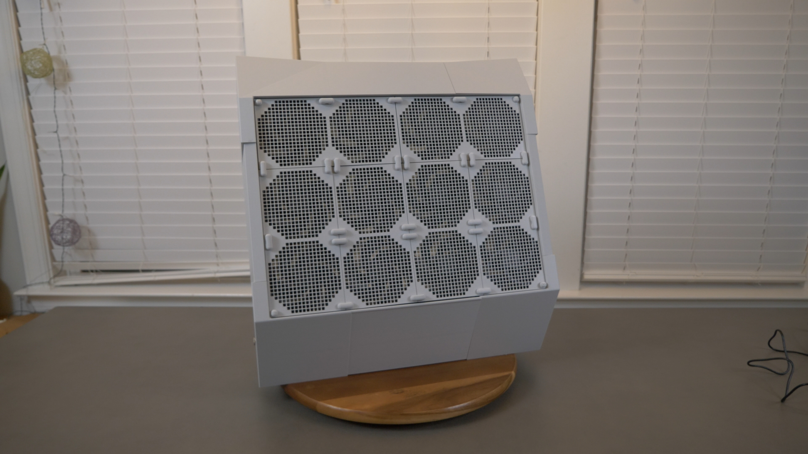

# The Nightingale 3DP: An Open-Source, 3D Printed, Ultra-Quiet, Effective Air Purifier With Low Maintenance Costs

A PC-fan based air purifier design, the Nightingale's major features are:  
- **3D Printed**: Most parts are 3D printed, including the air purifier housing, fan grills, and connectors. You only need a filter, super glue, some wiring, and an A/C adapter.
- **Effective**: Purifies air with one 20x20x5 MERV 13 air filter is efficient at removing pollen, dust, and infectious aerosols, but have very high air flow.  
- **Ultra-Quiet**: No need to turn it down or off due to noise because you'll barely know it's running. Uses PC fans designed to push a high volume of air quietly. 
- **Easy Filter Change**: When you change the filters simply open the lid and replace. No disassembly required.
- **Cheap Maintenance**: No pricey filter replacement costs. Simply use standard MERV 13, 20x20x5 furnace filters commonly available in the US at $35-$40. Change yearly or after wildfire events. 
- **Open-Source**: No vendor lock-in. Build it. It's yours. If you have a problem, fix it. 
- **Low Energy Consumption** Consumes only enough electricity for 12 PC fans. 
- **Slim Design**: About the size of a desktop computer, it doesn't take up much space. Sit against the wall, and due to the angled design, it will still have good airflow. Air flow angles up slighty to help room mixing. 
- **Easy Wiring**: Uses standard connectors interior connectors (DC) that plug together. No soldering required.  

# Release Notes

## Version 1 - Baseline
Released on Nov 24, 2025. 

## 3D Printed Components
- Print all the items in the Nightingale_3d_7percent.3mf file with 2 Wall Loops, 7% Gyroid fill (to save on filament)
- Print all the items in the Nightingale_3d_30percent.3mf file with 2 Wall Loops, 30% Gyroid fill (for additional strength)
- You should be able to print all components with less then 3 rolls of filament. 
- You need cable ties for the wiring and those can also be printed. 

## Parts to Buy
| Quantity | Item | Description | Cost | Link  |
| -------- | -----| --------- | ---- | ----- | 
| 1 | DC Barrel Jack | Used to easily connect to ac/dc adapter | $8 | 
| 1 | 12 volt, 4 amp AC/DC Adapter | Power source | $10 | [LINK](https://www.amazon.com/Converter-100-220V-Transformer-5-5x2-1mm-Accessories/dp/B08C594VNP/?th=1)
| 1 | 3 Way PWM Splitter | The splits 1 cable into 3 | $3 | [LINK](https://www.amazon.com/Splitter-Converter-Extension-Splitters-Computer/dp/B0DS2CVYZJ) (3-pack)
| 2 | 5-Port PWM Hubs | This connects multiple fans to power | $13 | [LINK](https://www.amazon.com/dp/B0CY521W9R/)
| 12 | P12 (120mm) PC Fans | Ideally, fluid bearings and advertised as quiet, Artic P12 is a solid inexpensive options | $68 | 2x [LINK](https://www.amazon.com/dp/B07HC7P3HJ/), 2x [LINK](https://www.amazon.com/ARCTIC-P12-120-Pressure-optimised-Quiet-Computer/dp/B07GB16RK7)
| 1 | MERV 13 20x20x5 Furnace Filter | Main filter for the unit | $45 | [LINK](https://www.nordicpure.com/product/20x20x5-air-filter/ ) |

Note: 20x20 furnace filters are NOT 20" long. They are always a little smaller. I designed this purifier to fit a filter with NordicPure sizing and some additional space for variances. 

## Other Parts and Tools
- Screwdriver - Connecting the fans to the panels
- Rubber mallet - Helps get stuff to fit snugly w/o damaging it
- Wood Glue - For affixing the filter holders
- Utility knife - Cutting zip ties, opening packages
- Cable ties - Organizing the wiring

# Assembly
[AssemblyVideo](https://youtu.be/DHxAwtPqRJc)

## Parts 
- Main body parts: M1, M2A, M2B, M3, M4, M5, M6, M7, M8
- Lid parts: L1, L2, L3
- Lots of: Pyramidal pins
- 48x Fan-through-rods
- 25x Dual rod connector
- 4x Single rod cover 
- 6x 2-Up fan grills

## Steps 
(Coming)

## FAQs

### Q: Why buy this instead of HEPA? 

- A: A HEPA filter is originally based on [World War II gas masks](https://en.wikipedia.org/wiki/HEPA), which explains the high efficiency. However, the high efficiency/low airflow is a disadvantage when purifying a room. HEPA purifiers tend to be big, loud, and have costly filter replacements. Furnace filter-based designs that use PC fans are an amazing combination of quiet and highly effective. 

### Q: What's the ideal environment for this design?

- A: I designed this as the purifier I would want in my kid's classroom. It can't be loud. And I don't want teachers to worry about turning it off/on or changing the speed settings. Finally, I wanted it to be durable, easy to fix if a component breaks, and easy to replace the filters. 

### Q: Why is it named 'The Nightingale'? 

- A: [Florence Nightingale](https://en.wikipedia.org/wiki/Florence_Nightingale) (1820-1910) was an activist, statistician, and the founder of modern Nursing. In her book, [*Notes on Nursing: What It Is, and What It Is Not*](https://archive.org/details/notesnursingwhat00nigh/page/6/mode/2up), she writes: 

> The very first canon of nursing, the first and the last thing upon which a nurse's attention must be fixed, the first essential to the patient, without which all the rest you can do for him is as nothing, with which I had almost said you may leave all the rest alone, is this: **TO KEEP THE AIR HE BREATHES AS PURE AS THE EXTERNAL AIR, WITHOUT CHILLING HIM.** 

### Q: What is the clean air delivery rate (CADR) of this unit? 

- A: I haven't had it officially tested by a reputable third party. Having 12 P12 Artic PC fans and a 20x20x5" filter, my best estimate is in the 300's for CADR. 

## Future Directions

## Acknowledgements

- [Corsi-Rosenthal Box](https://en.wikipedia.org/wiki/Corsi%E2%80%93Rosenthal_Box): In 2020, Corsi and Rosenthal popularized a simple DIY air purifier for removing airborne infectious disease using a box fan, furnace filters, and duct tape. At the time, the idea that a MERV 13 furnace filter, which has only [85% efficiency with tiny particles](https://www.ncbi.nlm.nih.gov/pmc/articles/PMC7127325/) could be better than HEPA filtration which has 99.99% efficiency seemed controversial. However, the key insight was that MERV 13 furnace filters had much better airflow than HEPA filters, which meant the total amount of clean air was much more. Disadvantages of the CR Box was only that it takes up space, the box fan can be louder than ideal for a classroom, and it's a temporary solution made with duct tape and is not extremely sturdy. [The Corsi-Rosenthal Foundation](https://corsirosenthalfoundation.org/) is a non-profit dedicated to promoting clean air and provides support to related charitable projects. 

- [Nukit Tempest](https://cybernightmarket.com/products/the-nukit-tempest-air-purifier-kit): An innovative and durable DIY air purifier design, the Tempest is made of metal and highly resembles a PC case. It's sleek and black, the six P14 fans are mounted inside, and it also takes 20x20x2 furnace filters. Overall, a near perfect design. Its only weaknesses are that you need to slightly disassemble the unit to replace the air filters, and you may not be able to tell that it's plugged in and running (because it's so quiet). Estimates are around 260-280 CFM. [A highly-recommended design](https://housefresh.com/nukit-tempest-review/) for situations where you want durable, simple, and ultra-quiet air cleaning. 

- [AirFanta Pro](https://www.amazon.com/AirFanta-based-Rosenthal-Purifier-3813ft2/dp/B0CJTYWQBT): Amazingly powerful and compact design using custom filters and PC fans, the 3Pro gets 430 CFM at full speed. It has a configurable adapter, which means if you don't mind the noise, you can crank it to max. However, if you want to limit the noise, you can lower the power. Importantly, this purifier is extremely portable -- you can pack it up inside a suitcase and take it with you. It's an absolute steal at <$200, especially considering the amazing cleaning power. I own several of these and enthusiastically recommend them to others. In particular, in schools where noise might not be as much of an issue (e.g., cafeteria, common areas), I think this is likely the best bang-for-the-buck. In classrooms, you can also purchase two of them and turn them to half speed.

- [CleanAirKits](https://www.cleanairkits.com/): The original DIY purifier kit builders, they offer many kit models with a lot of cleaning power using ultra-quiet PC fans. They've researched a ton of different PC fans and identified the good ones. I own several Tower of Power models and have recommended them often to friends. In fact, a luggable protects my dad when he's in the office meeting people. 
 
